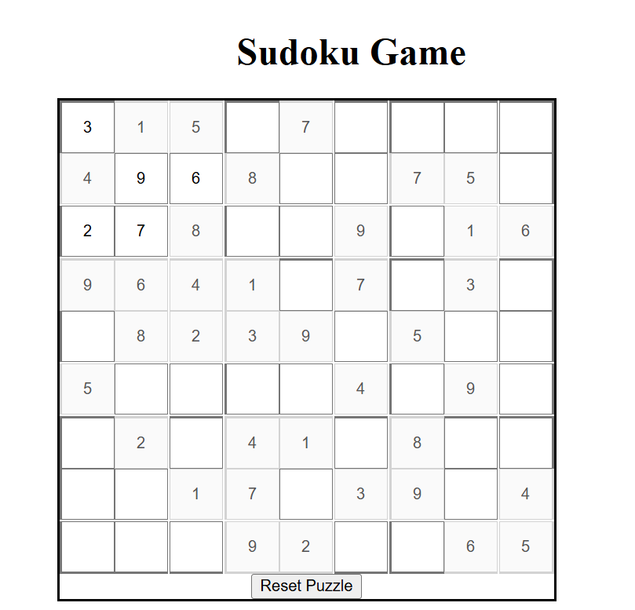

# 🧩 Sudoku Game

A classic Sudoku game built with **React + TypeScript**, styled using **Tailwind CSS**. Includes interactive input validation, reset functionality, and predefined puzzles.

---

## 🖼️ Preview

Here's what the game looks like in action:



---

## 🚀 Features

- ✅ Valid input enforcement (prevents invalid Sudoku moves)
- ✅ Reset puzzle to original state
- ✅ Load new puzzles from a set of predefined boards
- ✅ Clean and responsive UI using Tailwind CSS

---

## 📦 Tech Stack

- **React + TypeScript**
- **Vite** (modern frontend build tool)
- **Tailwind CSS** for utility-first styling
- **Sample puzzle logic** from static data

---

## 🖥️ How to Run This Project Locally

To run this Sudoku game on your local machine, follow these steps:

### 1. Clone the Repository

```bash
git clone https://github.com/your-username/sudoku-game.git
cd sudoku-game
```

> Replace `your-username` with your actual GitHub username or organization.

### 2. Install Dependencies

```bash
npm install
```

### 3. Start the Development Server

```bash
npm run dev
```

Then visit: [http://localhost:5173](http://localhost:5173)

---

## 🛠 Manual Setup (If Starting from Scratch)

### 1. Create Vite + React + TypeScript Project

```bash
npm create vite@latest sudoku-game --template react-ts
cd sudoku-game
npm install
```

### 2. Install Tailwind CSS

```bash
npm install -D tailwindcss postcss autoprefixer
npx tailwindcss init -p
```

### 3. Configure Tailwind

Edit `tailwind.config.js`:

```js
/** @type {import('tailwindcss').Config} */
export default {
  content: ["./index.html", "./src/**/*.{js,ts,jsx,tsx}"],
  theme: {
    extend: {},
  },
  plugins: [],
};
```

Edit `src/index.css`:

```css
@tailwind base;
@tailwind components;
@tailwind utilities;
```

---

## 📂 Project Structure

```
src/
├── App.tsx                 # Main app layout and control logic
├── main.tsx                # App entry point
├── index.css               # Tailwind base styles
├── components/
│   └── Sudoku.tsx          # Sudoku grid with input and validation
├── utils/
│   └── sudoku.ts           # Sample puzzles and validation helpers
```

---

## ✨ Planned Improvements

- [ ] Add backtracking-based puzzle generator in TypeScript
- [ ] Difficulty selector (Easy / Medium / Hard)
- [ ] Solve/check logic and hint system
- [ ] Timer with best-time storage

---

## 📜 License

MIT © [Vinay Jagannavar]


---